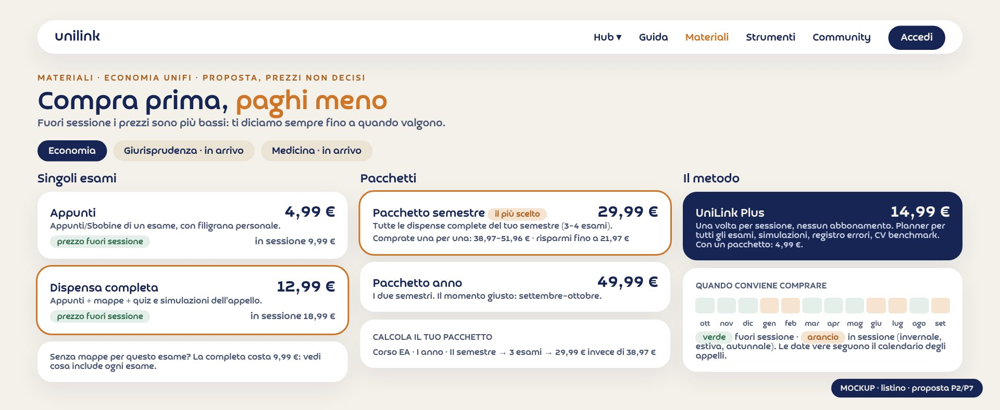
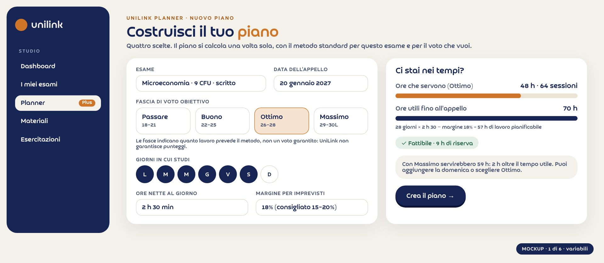
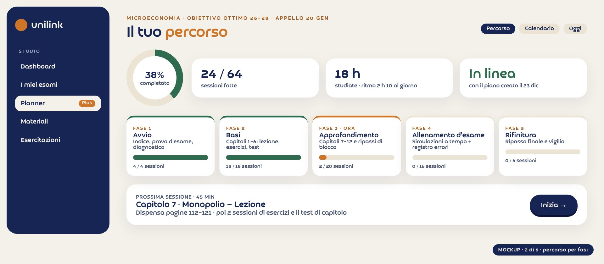
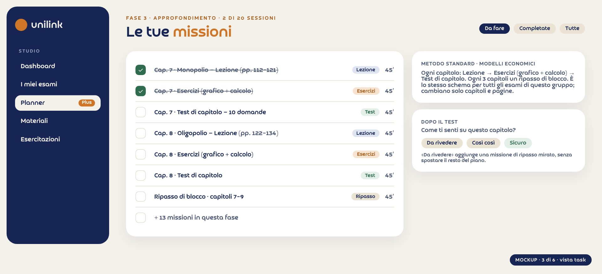
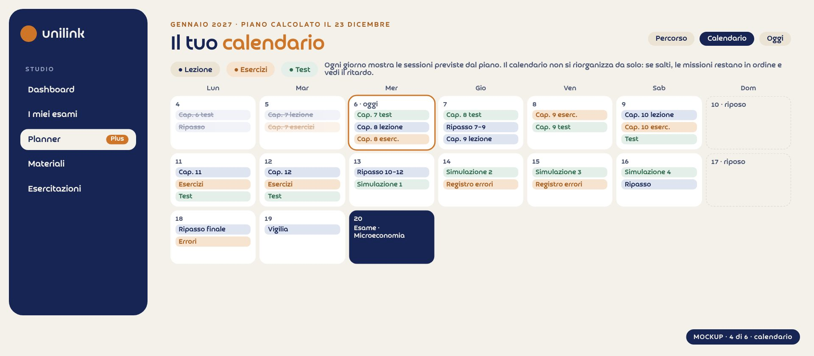
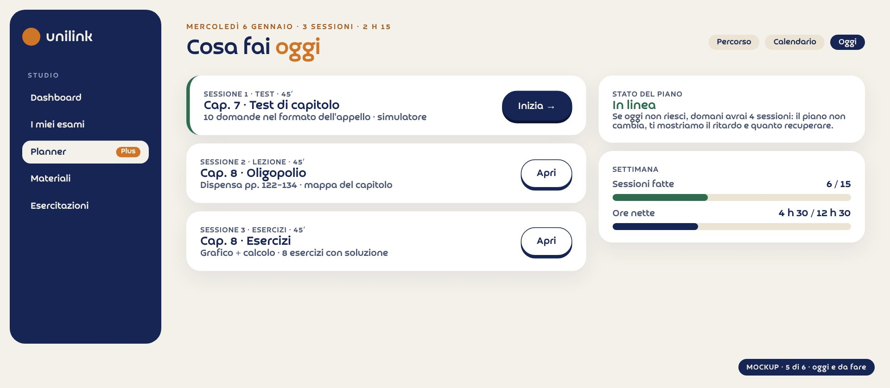
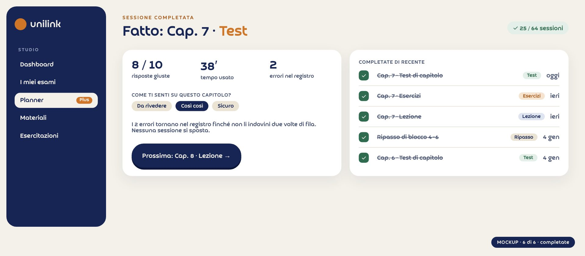

# UniLink · Proposte (B)

_Proposte discusse in chat il 7 ottobre 2026: né idee né decisioni definitive. Le osservazioni dei founder sono aggiunte; «Deciso in chat» prevale._

## Come leggere queste proposte
_né idee, né decisioni: proposte da approvare_

Questo documento raccoglie le proposte B discusse in chat il 7 ottobre 2026, a partire dai commenti dei founder sulla demo della landing (20 commenti, esportati il 7 ottobre). Una proposta è più di un'idea (ha un perché, dati di mercato, un piano e un modo per misurarla) ma non è ancora una decisione: si approva, si corregge o si scarta.

| Blocco | Cosa significa |
|---|---|
| Testo normale | La proposta di Claude, con analisi e dati. |
| Osservazione di Matteo | Ciò che hai aggiunto in chat: si aggiunge alla proposta, non la sostituisce. |
| Deciso in chat | Dove la tua osservazione cambia la proposta: vale questo. |
| Nota | Un rischio, un limite o qualcosa da verificare (legale, tecnico, dati). |

### Le proposte

| N. | Proposta | Esito in chat |
|---|---|---|
| P1 | Gruppi di studio: motore di acquisizione e retention, non prodotto | Approvata |
| P2 | Listino: singoli, pacchetti e Plus separati, prezzi del report e prezzo fuori sessione | Approvata, con la convenienza fuori sessione |
| P3 | UniLink Planner: piano standard per esame e fascia di voto, stile TTP | Approvata con modifiche: calcolato una volta sola |
| P4 | Orientamento: dentro gli hub e generale, nostro | Approvata: entrambi, nessun rimando esterno |
| P5 | Dopo la laurea e tesi per hub e corso di laurea | Approvata; B2B rimandato |
| P6 | Strumenti compatti con regole per corso | Approvata |
| P7 | Barra di navigazione: Hub · Guida · Materiali · Strumenti · Community · Accedi | Approvata, nome di «Market» da scegliere |
| P8 | Partnership con chi prepara ai test d'ingresso | Resta idea |

### Il principio di fondo: tutto per ogni facoltà

Ogni proposta è pensata per non restare chiusa su Economia, Giurisprudenza e Medicina. UniLink potrà aggiungere altre facoltà e corsi (Ingegneria nei suoi diversi tipi, Fisica, Matematica, Filosofia…). Per questo tutto ciò che dipende dal corso di laurea (regole del voto, tesi, sbocchi, orientamento, metodo di studio) si appoggia a un catalogo unico di corsi con le loro caratteristiche, e le pagine leggono da lì.

| Campo del catalogo dei corsi | Esempio |
|---|---|
| Area e scuola | Economia · Scuola di Economia e Management |
| Tipo | Triennale (180 CFU) · magistrale (120) · ciclo unico (300 o 360) |
| Regole del voto di laurea | Formula e premi (es. Economia UniFi: media + costante + premio di velocità) |
| Tesi | Tipi di prova finale, tempi, struttura, template, scadenze |
| Gruppi d'esame | Quantitativo, modelli, aziendale, giuridico, teorico, laboratorio, clinico… |
| Dopo la laurea | Magistrali, MSc, esami di Stato, albi, concorsi, specializzazioni |
| Orientamento | Con cosa si confronta (corsi vicini), per chi è, esiti occupazionali |
| Stato | Attivo · in arrivo · proposto |

## P1 · Gruppi di studio
_motore di acquisizione e retention, non un prodotto da vendere_

### Analisi di mercato

- Knowunity (20 milioni di utenti in 15 paesi, 45 M€ raccolti): i gruppi di studio sono una funzione dentro un'app freemium; i ricavi vengono dall'abbonamento premium e dall'employer branding (aziende come Vodafone e Porsche).
- Docsity (italiana, 14 milioni di utenti registrati): guadagna con abbonamenti a punti (15,99 € al mese, 29,97 € a trimestre, 59,88 € all'anno), documenti in vendita e tutoring. Non con i gruppi.
- WhatsApp e Telegram: i gruppi per corso e per anno esistono già, gratis e dominanti. Un «gruppo» in sé non si vende.

### Proposta

- I gruppi sono un motore per acquisire e trattenere studenti, non una voce di ricavo.
- Primo passo: un gruppo per esame e per appello, gratuito, creato e moderato dagli ambassador, con i materiali UniLink come base comune.
- Dentro Plus: «Studia con altri», cioè il piano condiviso dal gruppo, l'avanzamento di tutti visibile e una sessione settimanale guidata da un ambassador che ha preso 28 o più.

### Differenza dal tutoraggio

Il tutor insegna, uno a uno, a pagamento orario. Nel gruppo si è pari livello, ci si tiene il ritmo a vicenda e la struttura la dà il piano (P3); l'ambassador facilita, non fa lezione.

### Complicazioni

- Partenza a freddo: servono almeno 4–5 persone per esame e appello.
- Moderazione e privacy.
- Si condividono solo materiali UniLink o propri: niente slide dei professori.
- Chi esce da WhatsApp porta via il valore: il gruppo deve vivere anche dentro l'app.

### Prova a basso costo e regola di stop

3 esami, un appello. Si misurano iscritti al gruppo, attivi dopo 2 settimane e quanti comprano gli Appunti. Regola di stop: se meno del 30% è attivo dopo 2 settimane, si ferma.

> **Osservazione di Matteo.** «Mi piace la proposta, ok.» L'idea di partenza era che i gruppi d'esame potessero essere il vero valore di UniLink (scambio di materiali, idee e consigli, tutto con gli appunti UniLink), magari dentro Plus e distinti dal tutoraggio.

## P2 · Listino: singoli, pacchetti e Plus
_base: il report del 4 ottobre; prezzo più basso fuori sessione_

Prezzi proposti, non definitivi. Struttura della pagina: tre blocchi separati, «Singoli esami», «Pacchetti» e «Plus» (il metodo, a parte), più il calcolatore del pacchetto per corso, anno e semestre.

| Prodotto | Fuori sessione | In sessione | Cosa include |
|---|---|---|---|
| Account gratuito | 0 € | 0 € | 1 Appunti a scelta tra 3 esami (uno per anno) + 1 Appunti in regalo quando il primo amico invitato conferma l'email |
| Appunti | 4,99 € | 9,99 € | Appunti/Sbobine di un esame, con filigrana personale |
| Dispensa completa | 12,99 € | 18,99 € | Appunti + mappe + quiz e simulazioni dell'appello (9,99 € dove le mappe non ci sono) |
| Pacchetto semestre | 29,99 € | da decidere | Tutte le dispense complete del semestre (3–4 esami): comprate una per una 38,97–51,96 € |
| Pacchetto anno | 49,99 € | da decidere | I due semestri; il momento giusto è settembre–ottobre |
| UniLink Plus | 14,99 € una tantum | 14,99 € | Planner per tutti gli esami, simulazioni, registro errori, CV benchmark; vale per la sessione; con un pacchetto 10 € in meno |
| Tutoring 1-1 | 20 €/ora | 20 €/ora | Con chi ha preso 30 in quell'esame; pacchetto 3 ore 54 €; 75% al mentor |

_Mockup della pagina listino (proposta): singoli, pacchetti e Plus separati; prezzo fuori sessione e in sessione; quando conviene comprare._

### Le mie osservazioni

- La Completa a 12,99 è credibile solo dove ci sono mappe e quiz (oggi le mappe esistono per 17 corsi su 34): ogni esame mostra cosa include e, dove manca qualcosa, costa 9,99 €.
- Plus al lancio non lo venderei: oggi il simulatore copre 2 esami e il planner non esiste. Partirei con singoli e pacchetti e aprirei Plus quando planner e simulatore coprono almeno un semestre.
- Confronto: Docsity costa 15,99 € al mese ed è generico; noi siamo per singolo esame UniFi, quindi un prezzo per esame regge.
- Dopo la decisione va allineata la web app, che oggi ha 14,99 € per esame e Plus a 4,99 € al mese.

> **Osservazione di Matteo.** Mi piace soprattutto la parte di sconto, e soprattutto far vedere la convenienza: durante la sessione il prezzo aumenta, perché aumenta la domanda di appunti.

> **Deciso in chat.** Il listino mostra due prezzi per prodotto: «fuori sessione» (più basso) e «in sessione» (più alto), con il periodo in cui valgono. La pagina dice chiaramente «compra prima, paghi meno».

> **Nota.** Come dirlo nel modo corretto: annunciare in anticipo il prezzo più alto in sessione è trasparente. Quando, a sessione finita, il prezzo torna basso, non va presentato come «sconto» con prezzo barrato: la regola Omnibus (art. 17-bis del Codice del Consumo) vuole come riferimento il prezzo più basso dei 30 giorni precedenti. Meglio parlare di «prezzo fuori sessione» e «prezzo in sessione». Da far verificare a un consulente prima di pubblicare.

## P3 · UniLink Planner
_il metodo standard per ogni esame e fascia di voto, stile Target Test Prep_

### Cosa fa Target Test Prep (TTP)

- Si sceglie una fascia di punteggio obiettivo: Good (fino a 525), Very Good (535–575), Advanced (585–635), Expert (645–675), Expert+ (685 o più).
- Si inseriscono le ore al giorno e i giorni disponibili: la piattaforma costruisce il piano.
- Due modi di seguirlo: a missioni (lineare, argomento per argomento, si completano task) o a calendario (un programma giornaliero sui giorni e le ore disponibili). C'è anche un piano accelerato.
- Il metodo è standardizzato perché TTP prepara a un solo esame (il GMAT).

> **Nota.** Il sito di TTP non è raggiungibile da questo ambiente: le informazioni vengono da pagine pubbliche e recensioni (fonti in fondo). I mockup qui sotto seguono la logica descritta, in stile UniLink, e non copiano schermate di TTP.

### Proposta di Claude (dalla chat)

- Due viste, stile TTP: Percorso (fasi → capitoli → sessioni da 45 minuti, a task) e Calendario.
- Dati in ingresso: esami, date d'appello, voto obiettivo, sessioni al giorno, giorni di riposo, livello di partenza. Ogni tipo d'esame ha le sue regole (i gruppi del report: quantitativo, modelli economici, aziendale, giuridico, teorico).
- Il motore non è AI ed è il 90% del valore: regole precise, prevedibili, spiegabili ed economiche.
- Dove serve l'AI (senza allenarne una): trasformare il programma di un esame in capitoli e sessioni (una volta per esame, rivisto dal team); adattare il piano dopo un test andato male; spiegare il piano a parole. Costo: pochi centesimi per studente al mese.
- Fattibilità per non tecnici: sì, a fasi. v1 regole e un esame (gratis), v2 multi-esame (Plus), v3 adattamento con AI.
- PACRAR/ADC: collaborazione solo con un contratto (co-branding «metodo ispirato a»); senza, nome e metodo nostri.
- Nella landing (Durante): un esempio già pronto, solo da guardare, e «Crea il tuo piano» che porta all'area personale (serve la Completa o Plus).

> **Osservazione di Matteo.** Non farei il ricalcolo della proiezione: manterrei come in TTP. Con le variabili che ognuno inserisce, il piano viene calcolato e creato una volta sola, standardizzando il metodo per ogni esame e per ogni obiettivo di voto: passare l'esame 18–21, buon punteggio 22–25, ottimo 26–28, massimo possibile 29+, con un disclaimer che non garantiamo punteggi. Sotto, un indicatore di tempo sui giorni messi a disposizione e sulle ore nette al giorno, con uno scarto del 15–20%. La visualizzazione è divisa per fasi e ogni fase per sessioni, in base ai giorni che ognuno definisce. TTP lo fa standardizzato per un solo esame: io lo vorrei così per tutti gli esami (più lungo da fare, ma non complicato). L'architettura tecnica specifica non va ancora sviluppata: è un lavoro complesso se lo vogliamo fare bene. Ora serve l'idea e il design di tutte le sezioni: variabili, calendario, task, completati, da fare. L'AI teniamola presente, ma per ora può non essere fondamentale.

> **Deciso in chat.** Il piano si calcola una volta sola, alla creazione: niente ricalcolo automatico. Se si salta una sessione le missioni restano in ordine e si mostra il ritardo (rigenerare il piano è una scelta esplicita dello studente). Fasce di voto: Passare 18–21 · Buono 22–25 · Ottimo 26–28 · Massimo 29–30L, con disclaimer. Indicatore di fattibilità: ore che servono (dalla fascia) contro ore utili = giorni × ore nette × (1 − margine del 15–20%). L'AI non è necessaria nella prima versione.

### Il metodo standard, per ogni esame e fascia

Per ogni esame si definisce una volta: gruppo d'esame (che fissa lo schema delle sessioni per capitolo), capitoli con le pagine della dispensa, e il numero di sessioni per fascia. Le fasi sono le stesse per tutti: Avvio · Basi · Approfondimento · Allenamento d'esame · Rifinitura. Esempio (dati inventati per il mockup): Microeconomia, 9 CFU.

| Fascia | Voto | Sessioni da 45′ | Ore | Cosa cambia |
|---|---|---|---|---|
| Passare | 18–21 | 40 | 30 h | Lezione + un esercizio per capitolo, 2 simulazioni |
| Buono | 22–25 | 52 | 39 h | + ripassi di blocco, 3 simulazioni |
| Ottimo | 26–28 | 64 | 48 h | + seconda sessione di esercizi, 4 simulazioni, registro errori |
| Massimo | 29–30L | 78 | 59 h | + approfondimenti, domande d'orale, 6 simulazioni |

Le sessioni per fascia sono parametri del metodo da calibrare con i dati veri (ore reali per voto e per gruppo d'esame) e con le interviste a chi ha preso 28 o più.

### Design di tutte le sezioni (mockup)

_1 · Variabili: esame e appello, fascia di voto (con disclaimer), giorni in cui studi, ore nette al giorno, margine 15–20%. A destra l'indicatore «Ci stai nei tempi?»._

_2 · Percorso: le cinque fasi con avanzamento, sessioni fatte, ore studiate, stato rispetto al piano creato, prossima sessione._

_3 · Vista task (missioni): le sessioni della fase in ordine, con tipo e durata; dopo il test «Da rivedere / Così così / Sicuro»._

_4 · Calendario: le sessioni previste giorno per giorno, colori per tipo, giorni di riposo, esame. Non si riorganizza da solo._

_5 · Oggi e da fare: le sessioni di oggi, stato del piano e avanzamento della settimana._

_6 · Completate: esito della sessione, errori nel registro, cronologia delle sessioni fatte._

### Mercato

- Motion (19 $ al mese, sconto studenti 25%): ripianifica continuamente il calendario, ma è generico.
- Shovel: dice se il carico di studio ci sta nel tempo disponibile.
- StudySmarter/Vaia: piani con checklist e calendario dinamico, più flashcard.
- Exclam: trasforma i PDF d'esame in un piano datato con quiz e flashcard.
- Nessuno conosce gli esami UniFi e le vostre dispense. Il vantaggio difendibile: le pagine della dispensa collegate a ogni capitolo (già trovate per 485 capitoli su 580) e il formato reale della prova.

> **Nota.** La vostra scelta (piano calcolato una volta, nessun ricalcolo) è diversa da Motion e più vicina a TTP: è più semplice da costruire e più chiara per lo studente. Il rischio è che chi resta molto indietro abbandoni: per questo il ritardo va mostrato in modo chiaro, con la possibilità di rigenerare il piano.

## P4 · Orientamento
_dentro ogni hub e generale, costruito da noi_

Mercato: l'orientamento generico è saturo e gratuito (AlmaOrièntati di AlmaLaurea: test di 15 minuti con profilo personale; orientamento degli atenei). Su facoltà dove non siamo presenti non avremmo credibilità.

### Proposta di Claude (dalla chat)

- Togliere «Prima» dalla barra e metterla dentro ogni hub come scheda «Stai scegliendo?».
- Per Economia: EA contro EC (e più avanti SUSBUS) con esami a confronto, curriculum, sbocchi, voci di studenti e info sul TOLC-E. Per gli altri hub: Giurisprudenza ciclo unico; Medicina e semestre filtro.
- Target: studenti di quinta superiore e matricole a settembre; serve per arrivare da Google prima dell'iscrizione.

> **Osservazione di Matteo.** Cambiare nome alla scheda. Farei entrambi (dentro gli hub e un orientamento generale) e non rimanderei a nessun link esterno: lo creerei nostro, sulla base dei dati di chi lo ha già fatto. E non chiuso su queste facoltà: deve poter contenere anche Ingegneria (nei suoi diversi tipi), Fisica, Matematica, Filosofia e così via.

> **Deciso in chat.** Due livelli, entrambi nostri. 1) «Orientati» generale: un percorso a domande (interessi, materie forti, che lavoro immagini, quanto vuoi studiare) che restituisce aree e corsi compatibili con dati veri di esito (occupazione, stipendio, durata reale), presi da fonti pubbliche e dalle risposte dei nostri studenti. 2) Dentro ogni hub, la scheda «Scegliere» confronta i corsi vicini (es. EA contro EC). Entrambi leggono il catalogo unico dei corsi, quindi un corso nuovo si aggiunge senza rifare le pagine. Nessun rimando ad AlmaOrièntati.

> **Nota.** Nome della scheda: proposte «Orientati» (generale) e «Scegliere» (dentro l'hub). I dati di esito vanno citati con la fonte (es. indagini AlmaLaurea su condizione occupazionale) e aggiornati ogni anno.

## P5 · Dopo la laurea e tesi
_una struttura per tutti gli hub, contenuti per corso di laurea_

- Struttura uguale per ogni hub, contenuti diversi: Tesi · Dopo la laurea · Carriera.
- Tesi per corso di laurea: regole della prova finale (a Economia UniFi il voto è media + costante + premio di velocità: 2 punti entro il 31/12 del terzo anno, 1 entro il 30/4, poi 0); tipi di tesi, tempi, checklist, calendario delle consegne, template Word e LaTeX per corso.
- Prof consigliati: non una classifica (rischio reputazionale con i docenti), ma una guida «Come scegliere il relatore» e domande e risposte con i professori che accettano. Partnership di contenuto, senza soldi.
- Dopo la laurea, per hub: Economia con MSc e magistrali (Master finder, 163 programmi); Giurisprudenza con pratica forense, esame da avvocato, notariato, magistratura e studi per il praticantato; Medicina con il concorso di specializzazione e le differenze tra specialità.

#### Idea B2B (rimandata)

- Stampa della tesi: il mercato esiste (Mistertesi, Tesi24; circa 0,40 € a pagina a colori, copertina rigida da 12 €; esistono convenzioni universitarie con sconti del 10–25%). Proposta: convenzione con una copisteria vicino a Novoli, con codice sconto e commissione.
- Poi correzione bozze e controllo antiplagio. Mai scrittura della tesi su commissione.

> **Osservazione di Matteo.** Mi piace. Il B2B aspettiamo: è per un futuro che non abbiamo ancora deciso. Il resto top, ma non renderlo chiuso su queste tre facoltà: va fatto per tutte quelle possibili (Ingegneria nei suoi tipi, Fisica, Matematica, Filosofia…).

> **Deciso in chat.** Tesi e Dopo la laurea leggono il catalogo unico dei corsi: ogni corso ha le sue regole di prova finale, tipi di tesi, template e percorsi dopo la laurea (magistrali, esami di Stato, albi, concorsi, specializzazioni, dottorati). Le pagine sono generiche e si riempiono per corso. Il B2B resta un'idea, fuori dal primo passo.

## P6 · Strumenti
_compatti, universali, con regole per corso_

- Home: solo strumenti universali, compatti e d'impatto: voto di laurea (con regole per corso di laurea e scelta dell'hub), «Quanto pesa questo esame sulla media», conto alla rovescia per appello e sessione, «Erasmus: sei in tempo?».
- Grafica: altezza fissa, schede interne, colori diversi per i dati inseriti e i risultati; a colpo d'occhio si capisce cosa si sta guardando.
- Durante: solo media e voto obiettivo, esempio del piano (P3), Erasmus preciso.
- Regole per corso: ogni calcolatore legge un archivio di regole per corso di laurea (Economia e Giurisprudenza UniFi hanno documenti ufficiali diversi), verificate a mano.
- Bando sempre aggiornato: un controllo automatico mensile della pagina del bando segnala al team se è cambiata; una persona verifica e aggiorna. Il bando si può scaricare. Lettura e aggiornamento al 100% automatici no: un errore su un bando costa caro.

> **Osservazione di Matteo.** Sì, metti tutto. In home solo strumenti «for fun» che tutti possono usare, compatti, precisi e vincolati alle regole di ogni corso; il bando (es. Erasmus) scaricabile e sempre aggiornato.

## P7 · Barra di navigazione
_Hub · Guida · Materiali · Strumenti · Community · Accedi_

Proposta A (approvata): Hub ▾ · Guida · [listino] · Strumenti · Community · Accedi, più un menu «Founder» nascosto (Area personale in schermate, Da decidere, Commenti) che non andrà nel sito finale. Prima/Durante/Dopo diventano schede dentro ogni hub (Scegliere · Studiare · Dopo la laurea), perché cambiano per facoltà.

> **Osservazione di Matteo.** Al posto di «Market» un altro nome, tipo «Piani» o simili: cercane anche tu di migliori.

| Nome | Pro | Contro |
|---|---|---|
| Materiali | Dice cosa c'è (dispense, pacchetti, Plus); parola che gli studenti usano già. | Meno esplicito sul fatto che è a pagamento. |
| Piani | Chiaro su pacchetti e abbonamento. | Si confonde con il «piano di studio» (P3). |
| Dispense | Il prodotto principale, parola del vostro pubblico. | Non comprende Plus e tutoring. |
| Prezzi | Il più chiaro in assoluto. | Freddo, non fa venire voglia. |
| Shop | Immediato. | Troppo commerciale per «da studenti, per studenti». |
| Studia con UniLink | Caldo, parla di metodo. | Lungo per la barra. |

> **Deciso in chat.** Proposta di Claude: «Materiali» (si cambia con una riga di configurazione). La pagina contiene singoli, pacchetti e Plus (P2) e da ogni esame si apre la Preview.

## P8 · Partnership per i test d'ingresso
_resta un'idea_

- Attori: Alpha Test (libri e corsi), Testbusters (corsi, ha acquisito Ammesso.it), CISIA (che gestisce i TOLC). Non ho trovato programmi di affiliazione pubblici: va chiesto direttamente.
- Ha senso solo quando avremo traffico prima dell'iscrizione (P4): un link affiliato tracciato, una commissione per iscritto, un solo partner di prova.
- Rischio: diluire l'identità «studenti universitari».

> **Osservazione di Matteo.** Queste restano idee dentro la proposta.

## Come le proposte guidano le modifiche A
_cosa si costruisce adesso, in funzione delle proposte_

Le modifiche A (richieste chiare dei commenti) si costruiscono in modo da essere già pronte per le proposte B, senza anticipare decisioni non prese.

| Modifica A | Come si appoggia alle proposte |
|---|---|
| Barra di navigazione | P7: Hub ▾ · Guida · Materiali · Strumenti · Community · Accedi; menu «Founder» per Area personale, Da decidere, Commenti; voci allineate. |
| Materiali e Preview | P2: singoli, pacchetti e Plus separati, prezzo fuori sessione e in sessione; Preview del singolo esame con solo l'indice, motivi per comprare, «Compra» o «Accedi»; le tips su prof ed esami solo con l'account. |
| Catalogo in home (H06) | P2: diviso per hub con i corsi più scaricati e «Scopri la collezione completa» verso Materiali. |
| Prezzi in home | P2: un blocco «Compra prima, paghi meno» con i tre gruppi e il link a Materiali. |
| Guida | Pagina interattiva con una scheda per facoltà: Economia (triennale) completa dalla Guida essenziale, le altre con la struttura pronta (catalogo unico dei corsi). |
| Hub e fasi | P4, P5, P7: Prima/Durante/Dopo diventano schede degli hub (Scegliere · Studiare · Dopo la laurea), con struttura generica per ogni corso. |
| Strumenti in home (H08) | P6: strumenti compatti e universali, regole per corso. |
| Durante · piano | P3: esempio già pronto del planner, solo da guardare, e «Crea il tuo piano» verso l'area personale. |
| Chi c'è dietro (H09) | Foto segnaposto, LinkedIn, scheda personale di ogni founder con breve presentazione. |
| FAQ (H11) | Domande che portano ad aprire un account e ad acquistare. |
| Hero, numeri, scuole (H02–H04) | Testi e immagini nuovi; ogni testo e immagine segnato come campo modificabile in Framer. |
| Area personale (H06b) | Il pulsante porta all'accesso alla web app; la galleria va nel menu Founder. |

## Fonti
_ricerche fatte il 7 ottobre 2026_

- Knowunity: businessmodelcanvastemplate.com (come funziona); dealroom.co/companies/knowunity.
- Docsity: trend-online.com (come funziona); economyup.it (finanziamento).
- Target Test Prep: gmat.targettestprep.com/plans; recensioni topconsumerreviews.com e testpreppal.com; GMAT Club.
- Planner: mindomax.com (migliori app di pianificazione), Vaia/StudySmarter (App Store), alternativeto.net (Exclam).
- Orientamento: AlmaOrièntati (unibs.it), studenti.it.
- Prova finale: economia.unifi.it e statistica.unifi.it (regolamenti); giurisprudenza.unifi.it (voto di laurea).
- Stampa tesi: universita.it (Tesi24), Trustpilot (Mistertesi), aranzulla.it.
- Prezzi barrati: art. 17-bis Codice del Consumo (D.lgs. 26/2023, direttiva Omnibus).
